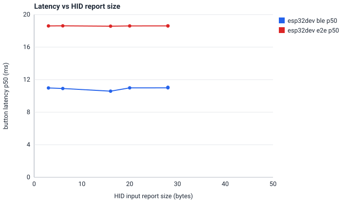

# Hardware-in-the-loop testing

The compile-only CI in this repo proves the library *builds* for every board.
It can't prove that `bleGamepad.press(5)` produces one distinct key event on a
real host, that all 128 buttons and both axis sign conventions map correctly,
that the Device Information / PnP / battery values actually reach a GATT client,
or how fast reports get through the air. A separate **hardware-in-the-loop (HIL)
rig** does that, driving the real firmware on a real ESP32 and asserting the
result on a Linux host's `/dev/input/event*` and GATT stack.

- Rig repo: <https://github.com/LeeNX/ESP32-BLE-Gamepad-HIL>
- Rig hardware: a Raspberry Pi with one or more ESP32 boards on a powered USB
  hub and a BLE adapter.

## How it fits together

```
  this repo (working tree)                    tester (Raspberry Pi + ESP32 + BLE)
  ┌────────────────────────┐   bundle  +       ┌───────────────────────────────┐
  │ scripts/hil.sh:        │   harness code    │ tester/test.sh:               │
  │  build hil_runner fw   │ ────rsync/ssh───► │  esptool flash (no PlatformIO)│
  │  against THIS checkout │                   │  pytest  (evdev + BlueZ)      │
  │                        │ ◄───results/──────│  + --bench latency sweep      │
  └────────────────────────┘                   │   ESP32 ─BLE─► /dev/input/... │
        hil-results/  ◄── charts/table         └───────────────────────────────┘
```

The tester never compiles anything. Firmware is built here (or on a CI runner)
and pushed as a flashable bundle. Command injection into `hil_runner` is over
**USB serial**, a channel independent of the BLE path under test.

## Running it

Prerequisites on your machine: PlatformIO (`pio`), a local clone of the rig
repo, and ssh access to the tester.

```bash
git clone https://github.com/LeeNX/ESP32-BLE-Gamepad-HIL ~/src/ESP32-BLE-Gamepad-HIL

# from this repo, on whatever branch/working tree you want tested:
HIL_SSH_HOST=<tester> HIL_SSH_USER=<user> scripts/hil.sh          # functional suite
HIL_SSH_HOST=<tester> HIL_SSH_USER=<user> scripts/hil.sh --bench  # + latency benchmark
scripts/hil.sh --boards esp32dev --profiles "default maxbtn"
scripts/hil.sh --profiles default -- -k buttons                   # args after -- go to pytest
```

`scripts/hil.sh`:

1. writes a temporary `hil_config.local.toml` in the rig checkout pointing the
   builder at **this working tree** (uncommitted changes included) and at the tester;
2. builds the `hil_runner` firmware bundles here;
3. rsyncs the harness code **and** the bundles to the tester (its real
   serial-port config is preserved);
4. ssh-runs `tester/test.sh` for each bundle — esptool flash, re-pair on any HID
   descriptor change, pytest, and (with `--bench`) the benchmark sweep;
5. pulls `results/` back into `./hil-results/` (gitignored) and regenerates the
   distilled table + SVG charts.

Env: `HIL_REPO`, `HIL_SSH_HOST`, `HIL_SSH_USER`, `HIL_SSH_KEY`, `HIL_PIO`. To
run it from GitHub Actions, point `HIL_SSH_HOST` at a runner-reachable name for
the tester (e.g. a Tailscale MagicDNS name) — nothing else changes.

## From CI

The rig repo's `.github/workflows/hil.yml` does the same build→ssh→test flow
from GitHub-hosted runners: it builds the firmware bundles, joins the tailnet as
an ephemeral node (`tailscale/github-action`), and ssh-es to the tester by its
MagicDNS name — no self-hosted runner, no inbound ports. It accepts a
`repository_dispatch` of type `hil` with `client_payload.lib_repo` /
`lib_ref`, so this library repo can hand it a ref to test.

This repo's `.github/workflows/hil.yml` is that trigger. It runs on push to
`master`, on PRs that touch the HID/report/GATT source (path-filtered), weekly,
and on demand (`workflow_dispatch` with an optional `lib_ref`). It fires the
`repository_dispatch`, then blocks until the rig run finishes and takes on its
pass/fail, linking the rig run in the job summary. Fork PRs are skipped (the rig
can't reach a fork, and they get no secrets).

Setup:

| Where | What |
|---|---|
| rig repo secrets | `TS_OAUTH_CLIENT_ID` / `TS_OAUTH_SECRET` (Tailscale OAuth client, `tag:ci`, "Auth Keys" write); `HIL_TESTER_HOST` (tester MagicDNS name), `HIL_TESTER_USER`, `HIL_TESTER_SSH_KEY` |
| rig tailnet ACL | `tag:ci` → tester `tcp:22` |
| tester | `tailscale up` (tagged for the ACL); CI public key in `~/.ssh/authorized_keys`; `tester/bootstrap-host.sh` installs Tailscale |
| this repo secret | `HIL_DISPATCH_TOKEN` — PAT for the rig repo with **Contents: write** (POST `repository_dispatch`) + **Actions: read** (poll the run). Set on **both** repos in `hil.yml`'s `if:` guard (upstream `lemmingDev/ESP32-BLE-Gamepad` and the `LeeNX` fork) — each has its own. Step-by-step: *Creating `HIL_DISPATCH_TOKEN`* below |
| rig repo default branch | `hil.yml` must be on it — `repository_dispatch` only runs the workflow file version on the default branch |
| this repo variables (optional) | `HIL_RIG_REF` — a rig tag; setting it makes `release.yml` attach the firmware set (below). `HIL_RIG_REPO` — the rig repo, default `LeeNX/ESP32-BLE-Gamepad-HIL` |

### Creating `HIL_DISPATCH_TOKEN`

A **fine-grained** personal access token, created by someone with write access
to the rig repo (`LeeNX/ESP32-BLE-Gamepad-HIL`):

1. github.com → your avatar → **Settings** → **Developer settings** →
   **Personal access tokens** → **Fine-grained tokens** → **Generate new token**
2. **Resource owner**: `LeeNX` (the rig repo's owner). If that's an org, its
   settings may need to allow fine-grained PATs / approve the token afterwards.
3. **Repository access** → *Only select repositories* → `LeeNX/ESP32-BLE-Gamepad-HIL`
4. **Permissions** → *Repository permissions*:
   - **Contents**: *Read and write* — to `POST /repos/…/dispatches`
   - **Actions**: *Read-only* — to poll the dispatched run
   - (*Metadata: Read-only* is added automatically)
5. Set an **expiration** you'll rotate before it lapses (CI breaks silently when
   it expires — the dispatch step fails with `HIL_DISPATCH_TOKEN … not set`).
6. **Generate token** and copy it.

Then add it to **each** repo whose `hil.yml` runs (`lemmingDev/ESP32-BLE-Gamepad`
and `LeeNX/ESP32-BLE-Gamepad` — whichever you operate):

7. Repo → **Settings** → **Secrets and variables** → **Actions** → **Secrets** →
   **New repository secret**
8. Name `HIL_DISPATCH_TOKEN`, value = the token.

Classic-PAT alternative: **Generate new token (classic)** with the `repo` scope —
simpler, but grants far more than needed; prefer fine-grained.

### Firmware artifacts on releases

When `HIL_RIG_REF` is set, `release.yml` adds a `hil-firmware` job: it checks out
the rig at that ref, builds the `hil_runner` firmware for every board × profile
against the tag, and attaches `esp32-ble-gamepad-hil-firmware-<tag>.zip` (+
`.sha256`) to the GitHub Release. The zip holds the flashable `.bin` sets +
`manifest.json` per bundle, the golden HID descriptors, `INDEX.json` (library +
rig commit), and `REPRODUCE.md`.

This lets anyone reproduce a HIL run with **no PlatformIO**: unzip, flash a
bundle with `esptool` (or the rig's `tester/flash.py`), and run the rig's pytest
suite against it. The job needs no secrets — the rig is a public checkout,
building is just PlatformIO, and the upload uses `GITHUB_TOKEN`.

## Other forks and upstream

The rig and its Tailscale / tester secrets live in
`LeeNX/ESP32-BLE-Gamepad-HIL`. `hil.yml`'s `if:` guard already runs it for
upstream `lemmingDev/ESP32-BLE-Gamepad` and the `LeeNX` fork — those two just
need their own `HIL_DISPATCH_TOKEN` secret (above). A fork in any *other*
namespace has three options, cheapest first:

**1. On demand, no setup.** The rig's `hil.yml` takes `lib_repo` + `lib_ref`
inputs, so from the rig repo's Actions tab → **HIL** → *Run workflow*:

- `lib_repo` = `https://github.com/<owner>/ESP32-BLE-Gamepad.git`, `lib_ref` =
  a branch / tag / SHA
- for a contributor's PR: `lib_repo` = their fork URL, `lib_ref` = their branch
  (not `refs/pull/N/head` — the builder does `git clone --branch`)

The rig clones that ref, builds `hil_runner` against it, and runs the full
suite. Works for any public ref with zero changes to the target repo.

**2. Adopt `hil.yml`, pointed at the LeeNX rig.** Add the fork's
`github.repository` to this workflow's `if:` guard and add `HIL_DISPATCH_TOKEN`
(see *Creating `HIL_DISPATCH_TOKEN`* above — scoped to `LeeNX/ESP32-BLE-Gamepad-HIL`
only), minted by someone with write on the rig.
Cross-org, so the rig owner must accept the fork's CI driving their hardware;
the `concurrency` groups on both sides plus the rig's single physical tester
keep runs from colliding. Fork PRs still can't run automatically (no secrets on
fork PRs) — a maintainer dispatches those by hand per option 1.

**3. Run an independent rig.** Fork `ESP32-BLE-Gamepad-HIL`, attach a
Raspberry Pi + ESP32(s) + BLE adapter on a powered hub, run
`tester/bootstrap-host.sh` → `bootstrap.sh` → `tailscale up`, set the five rig
secrets + the tailnet ACL, and set the fork's repo variable
`HIL_RIG_ENABLED=true`. Then this repo's `HIL_DISPATCH_TOKEN` and
`HIL_RIG_REPO` / `HIL_RIG_REF` point at that fork. Fully self-contained — the
rig is already parameterised for it (`LIB_REPO` / `LIB_REF`, `HIL_TESTER_*`).

## What it covers

| Area | Tests |
|---|---|
| Buttons | every configured button → one distinct evdev key, one-to-one, in the gamepad key range. `maxbtn` (128) pins the finding that Linux only surfaces ~79 of them — `BTN_GAMEPAD + n` runs out of the named key block at `0x17e` (a game using evdev/SDL sees the same) |
| Axes | each axis → exactly one ABS code, monotonic, exact min/centre/max endpoints, well-known code mapping; negative rail via `signed-axes` |
| Hats | 8 directions + centre; the Linux "only `ABS_HAT0` surfaces" and reversed-emission quirks pinned as strict xfails |
| Special buttons | start/select/menu/home/back/vol± → one event each, across every input node the device exposes |
| Connection | BEGIN → connected → evdev node with a sane capability set |
| HID descriptor | the descriptor the library generated (`getHidReportDescriptor()`) matches its reported size, the copy the **kernel received over GATT** (`/sys/class/hidraw/…/report_descriptor`), and a checked-in golden per profile — catches generation regressions and BLE truncation |
| Device Information | model / serial / firmware / hardware / software revision + manufacturer, read over GATT, match what the firmware configured |
| PnP ID | `0x2A50` vendor/product/version match `setVid`/`setPid`/`setGuidVersion` |
| Battery | `setBatteryLevel()` read back via the raw `0x2A19` char, BlueZ's `Battery1` D-Bus property, and `upower` (where installed); nothing in `/sys/class/power_supply` (BLE Battery Service, not a HID battery usage). `setPowerStateAll()` charging/discharging bitfield read from `0x2A1A` |
| Feature / Output reports | `reports` profile: Feature Report round-trips both directions (`setFeatureBuffer()` ↔ `HIDIOCGFEATURE`, `HIDIOCSFEATURE` ↔ `getFeatureBuffer()`); Output Report host→device via `write(/dev/hidraw*)` → `getOutputBuffer()` |
| Latency / throughput | see below |

Compile profiles (rig `firmware/include/hil_profile.h`): `default`,
`signed-axes`, `specials`, `minimal` (smallest possible report), `maxbtn`
(128 buttons — the library's ceiling), `reports` (Output + Feature Report
enabled).

## Performance characteristics

`scripts/hil.sh --bench` measures, per profile:

- **Per-event latency** — button / axis / hat, host-side, split into the
  BLE-air-plus-host-stack portion and the full end-to-end figure (p50/p90/p99).
- **Sustained report rate** — how many rapid toggles per second actually reach
  the host before the BLE link or host input stack starts dropping them, at a
  range of inter-report spacings.
- **Connection interval / MTU** — the negotiated BLE parameters that set the
  ceiling on report rate.
- **HID report + descriptor size** — so latency and throughput can be plotted
  against payload size. The five profiles span 3-byte (`minimal`) to 28-byte
  (`default` / `signed-axes`) input reports.

Raw data lands in the rig's `results/bench-*.json`; a distilled
`results/bench-table.md` and three SVG charts are regenerated by
`python -m hil.charts` and committed here under [docs/hil/](docs/hil/).

### Baseline — esp32dev, ESP32-BLE-Gamepad `v0.7.5-rc0`

Tester: Raspberry Pi 3B+ (built-in BT 5.0 adapter), Debian 13, kernel 6.18.34,
BlueZ 5.82, Python 3.13. Full data in `docs/hil/bench-table.md`.

| Profile | HID report | Descriptor | Conn interval | Button latency e2e p50 / p99 | Dropped / 200 | Clean paced rate |
|---|---|---|---|---|---|---|
| minimal (1 btn, 1 axis) | 3 B | 50 B | 48.75 ms | 18.6 / 67.8 ms | 0 | 128 Hz |
| reports (16 btn, 2 axis + Feature/Output) | 6 B | 82 B | 48.75 ms | 18.6 / 67.5 ms | 0 | 81 Hz |
| maxbtn (128 btn) | 16 B | 25 B | 48.75 ms | 18.6 / 67.6 ms | 0 | — |
| specials (16 btn, 8 special) | 20 B | 132 B | 48.75 ms | 18.6 / 67.5 ms | 0 | 122 Hz |
| default (64 btn, 4 hat, 8 axis) | 28 B | 102 B | 48.75 ms | 18.6 / 68.0 ms | 0 | 83 Hz |
| signed-axes | 28 B | 102 B | 48.75 ms | 18.6 / 67.8 ms | 0 | 110 Hz |



**What this shows:**

- **A single button press reaches the host in ~18.6 ms** (median), of which
  ~11 ms is BLE air time + the host input stack and ~7.6 ms is the rig's own
  USB-serial command + firmware parse. p99 ~68 ms — roughly one connection
  interval of jitter.
- **Zero dropped events.** Every one of 200 deliberately-paced presses per
  profile produced exactly one host event.
- **Latency is flat against HID report size** (3 → 28 bytes). At a 255-byte MTU
  the report fits in one link-layer packet regardless, so payload size costs
  nothing.
- **The connection interval is 48.75 ms on every profile** — this library does
  not request a fast one (typical BLE HID negotiates 7.5–15 ms). It bounds
  *latency* (you wait up to one interval for the next connection event) but
  **not** the sustained *rate* of paced updates: NimBLE sends several packets
  per connection event, so paced state changes (one at a time, waiting for it
  to land) deliver ~100 % at **80–130 Hz** — in this rig it's the USB-serial
  command channel that runs out first, not BLE.
- **Unpaced bursts are a different story.** Calling `sendReport()` in a tight
  loop (the `BURST` command) overflows NimBLE's transmit queue and the ESP32
  drops the surplus *silently, before it goes on air* — at `gap=0` only ~2 % of
  a 500-report burst survives. The `burst` columns in `bench-table.md` show
  that curve. Takeaway for firmware: don't `sendReport()` faster than you can
  transmit; pace it, or coalesce.

Absolute figures carry host-scheduling jitter — treat them as comparative
across profiles and as a regression baseline, not a hard guarantee.

## See also

- [LinuxHIDTesting.md](LinuxHIDTesting.md) — doing the same checks by hand on a
  Linux box: pairing, `hidraw`/`hidapi`, `jstest`/`evtest`, `upower`, `btmon`.
- [GattVsHid.md](GattVsHid.md) — why the HID service is invisible to a generic
  GATT client once paired, while Device Information / Battery stay readable
  (which is what makes the GATT tests above possible).
